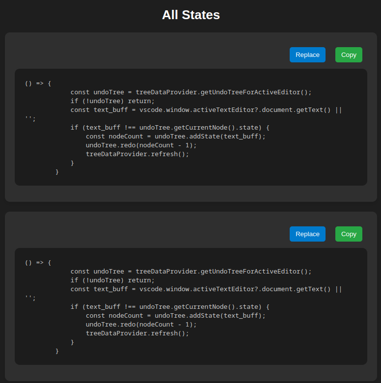
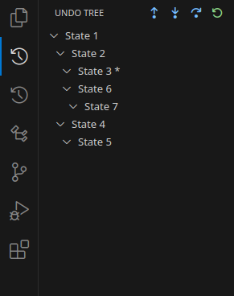

## Undotree

Undotree is a powerful VSCode extension designed to enhance the traditional undo-redo functionality by introducing a tree structure to track and navigate code changes more effectively. This extension provides developers with greater control over their development history, allowing them to view and restore previous versions of code without losing valuable information or trial-and-error attempts.

With Undotree, developers no longer need to worry about the linear limitations of the standard undo-redo system. Whether you want to revisit different approaches, compare versions, or navigate complex coding structures, Undotree is here to simplify the process.

## Features

- **Undo and Redo**: Navigate through different states of your code in a non-linear way using a tree structure.
- **Save and Advance**: Save a point in the tree and move forward, ensuring that all your significant changes are preserved.
- **Reset Tree**: Clear the undo tree and start fresh.
- **Selective Undo/Redo**: Select a piece of code, view all previous versions of that specific snippet, and choose the version you want to replace or copy.
- **Timecode Toggle**: Optionally display timecodes associated with different states for better tracking.

## Commands

The following commands are available within the extension:

- `UndoTree: Undo (alt+z)`: Undo a change.
- `UndoTree: Redo (alt+y)`: Redo a previously undone change.
- `UndoTree: Save and Advance (alt+s)`: Save the current state and continue.
- `UndoTree: Reset Tree`: Reset the entire undo tree.
- `UndoTree: Selective Undo (alt+v)`: Select a piece of code, and view and manage its previous versions.
- `UndoTree: Toggle Showing Timecode`: Toggle the visibility of timecodes associated with each state.

## Keybindings

| Command                          | Keybinding |
|-----------------------------------|------------|
| Undo Tree: Undo                  | alt+z      |
| Undo Tree: Redo                  | alt+y      |
| Undo Tree: Save and Advance      | alt+s      |
| Undo Tree: Selective Undo/Redo   | alt+v      |


## Reference Images





## Installation

1. Install the extension from the [Visual Studio Code Marketplace](https://marketplace.visualstudio.com/).
2. You can also clone the repository and run the following commands to set it up locally:

```bash
git clone https://github.com/pavandhadge/undotree.git
cd undotree
yarn install
```

Development

To develop and test this extension, ensure that you have Node.js and yarn installed. You can use the following scripts:

    yarn compile: Compile the TypeScript source files.
    yarn watch: Watch for changes and recompile automatically.
    yarn lint: Lint the source code using ESLint.
    yarn test: Run the test suite.

Repository

    GitHub Repository: https://github.com/pavandhadge/undotree.git

Maintainers

    Pavan Dhadge and Team


License
This project is licensed under the GPL License.