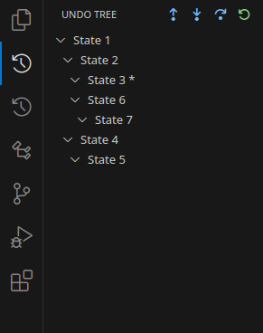
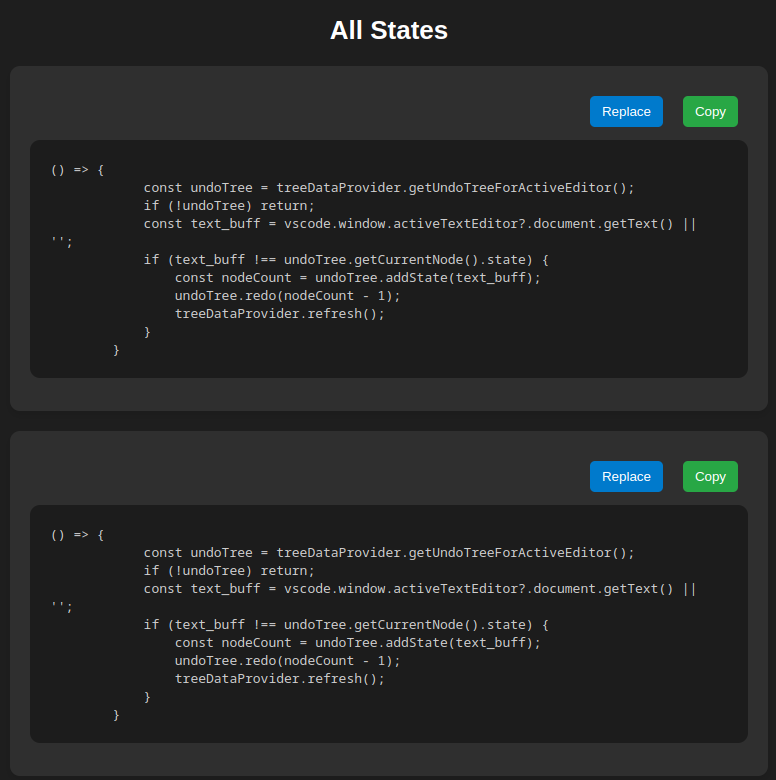

# RewindCode (Undotree)

RewindCode is a powerful VSCode extension designed to enhance the traditional undo-redo functionality by introducing a tree structure to track and navigate code changes more effectively. This extension provides developers with greater control over their development history, allowing them to view and restore previous versions of code without losing valuable information or trial-and-error attempts.

With RewindCode, developers no longer need to worry about the linear limitations of the standard undo-redo system. Whether you want to revisit different approaches, compare versions, or navigate complex coding structures, RewindCode simplifies the process.

## Features

- **Undo and Redo**: Navigate through different states of your code in a non-linear way using a tree structure.
- **Save and Advance**: Save a point in the tree and move forward, ensuring that all your significant changes are preserved.
- **Reset Tree**: Clear the undo tree and start fresh.
- **Previous Versions**: Select a piece of code, view all previous versions of that specific snippet from history, and choose the version you want to replace or copy.
- **Timecode Toggle**: Optionally display timecodes associated with different states for better tracking.

## Supported Languages

RewindCode currently supports the following programming languages:

- **JavaScript (JS)**
- **TypeScript (TS)**
- **Python**
- **Java**
- **C++**
- **C**
- **C#**
- **Go (Golang)**
- **Rust**
- **Swift**
- **Kotlin**
- **Ruby**
- **HTML/CSS**
- **PHP**
- **Bash**

Currently, **JavaScript (JS) and TypeScript (TS) are in production**, while the rest of the languages are in **testing and development stages**.

## Commands

The following commands are available within the extension:

- `RewindCode: Show Previous Versions (alt+v)`: Select code and view all its previous versions from history.
- `UndoTree: Undo (alt+z)`: Undo a change.
- `UndoTree: Redo (alt+y)`: Redo a previously undone change.
- `UndoTree: Save and Advance (alt+s)`: Save the current state and continue.
- `UndoTree: Reset Tree`: Reset the entire undo tree.
- `UndoTree: Toggle Showing Timecode`: Toggle the visibility of timecodes associated with each state.

## Keybindings

| Command                          | Keybinding |
|-----------------------------------|------------|
| Undo Tree: Undo                  | alt+z      |
| Undo Tree: Redo                  | alt+y      |
| Undo Tree: Save and Advance      | alt+s      |
| RewindCode: Previous Versions    | alt+v      |

## Reference Images



## Installation

1. Install the extension from the [Visual Studio Code Marketplace](https://marketplace.visualstudio.com/).
2. You can also clone the repository and run the following commands to set it up locally:

```bash
git clone https://github.com/pavandhadge/undotree.git
cd undotree
npm install
```

## Configuration

Create an `undotree.config.json` file in your project root to customize behavior:

```json
{
    "language": {
        "name": "javascript",
        "ismodule": true
    },
    "framework": {
        "name": "react"
    },
    "func-recommendation": {
        "active": true,
        "threshold": 0.7
    }
}
```

## Development

To develop and test this extension, ensure that you have Node.js and npm installed. You can use the following scripts:

```bash
npm run compile   # Compile the TypeScript source files.
npm run watch     # Watch for changes and recompile automatically.
npm run lint      # Lint the source code using ESLint.
npm run test      # Run the test suite.
```

## Repository

- **GitHub Repository:** [https://github.com/pavandhadge/undotree](https://github.com/pavandhadge/undotree)

## Maintainers

- **Pavan Dhadge and Team**
